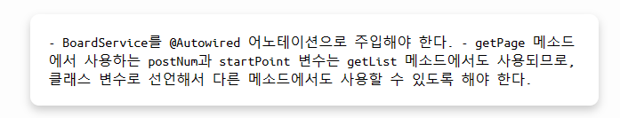

# GPT 코드 리뷰어
<center> </center>

<br>

## 프로젝트 소개 
OpenAI API를 이용하여 gpt-3.5-turbo에게 코드가 담긴 프롬프트를 전달하고, 수정된 코드 및 그에 대한 피드백을 받을 수 있습니다. 

<center> </center>
<center> 내가 작성한 코드</center>
<br>
<center> </center>
<center> GPT가 작성한 코드</center>
<br>
<center> </center>
<center> GPT가 써준 리뷰</center>
<br>


## 기술 스택
Next.js, CodeMirror

<br>

## 프로젝트 실행법
사전 숙지 사항<br>
1. nodeJS 깔려 있어야 함 
2. next.js 깔려 있어야 함 
<br>
<br>

```
//프로젝트 폴더 들어가기 
$ cd gpt-code-reviewer
``` 
```
//depencdency에 있는 모듈들 다운로드 
$ npm install 
```
Containerse.tsx에서 api key 넣기
```
export default function Containers() {
    ...
    const answerResponse = async (code: string) => {
        const configuration = new Configuration({
        organization: "org-kPK4gvboaN3yb7QIlW7s8Dd9",
        apiKey: "openAI에서 발급 받은 API key 넣기",
        });
    ...
}
```

```
$ npm run dev
```

## 참고사항
프롬프트는 원하는 바가 있으시면 fork하셔서 따로 수정하시면 됩니다.

Containerse.tsx에서 api key 넣기
```
export default function Containers() {
    ...
    const answerResponse = async (code: string) => {
        ...
        openai.createChatCompletion({
        model: "gpt-3.5-turbo",
        messages: [{ role: "user", content: code + `프롬프트 수정할 부분`}],
        }).then(response => {
    ...
}
```
